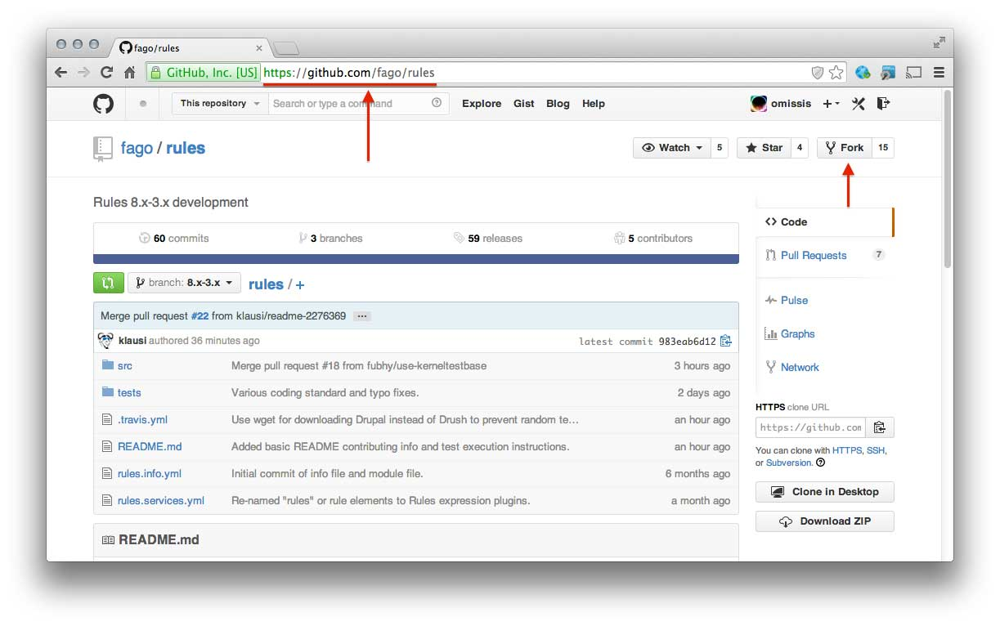
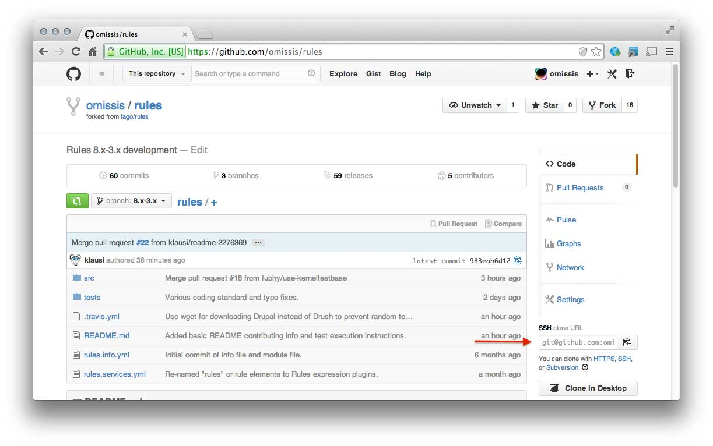
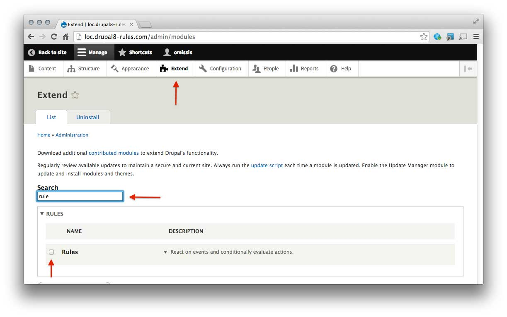

Rules for Drupal 8
------------------

[](https://travis-ci.org/fago/rules)

The Rules module allows site administrators to define conditionally executed
actions based on occurring events (ECA-rules).

Project homepage: http://drupal.org/project/rules

Contributing
------------

For some time development will happen on github and will be using the pull request model: in case you are not familiar with that, please take a few minutes to read the [github article](https://help.github.com/articles/using-pull-requests) about that topic.

There are a few conventions that should be followed when contributing:

* Always create an issue in the [drupal.org Rules issue queue](http://drupal.org/project/issues/rules) for every pull request you are working on;
* Always cross-reference the Issue in the Pull Request and the Pull Request in the Issue;
* Always create a new branch for every pull request: its name should contain a brief summary of the ticket and its issue id, e.g **readme-2276369**;
* Try to keep the history of your pull request as clean as possible by squashing your commits: you can look at the [Symfony documentation](http://symfony.com/doc/current/cmf/contributing/commits.html) or at the [Git book](http://git-scm.com/book/en/Git-Tools-Rewriting-History#Changing-Multiple-Commit-Messages) for more information on how to do that.

Setting up the environment
--------------------------

### LAMP

The very first step for starting contributing to Rules is to setup a classic "LAMP" environment: that's a bit out of the scope of this document, so please take a look at [Drupal Installation Guide](https://drupal.org/documentation/install) and especially at its [System requirements section](https://drupal.org/requirements).

### Drupal 8

Once you've got your system ready to host Drupal 8, the next step is to go and clone its repository in the directory where your web server will expect it to be by using the following command:

```git clone --branch 8.x http://git.drupal.org/project/drupal.git```

Please look at the [Drupal Git Instructions](https://drupal.org/project/drupal/git-instructions) for more information about how to clone Drupal.

Once you finished cloning Drupal, set up a database for it and proceed with the installation: after it's completed, the only thing's missing is the Rules module.

### Rules

#### NOTE: you will need a working github account for contributing to Rules.

In order to start working on Rules, you have to visit its [module page on github](https://github.com/fago/rules) and **click the Fork button**.



That will create a copy of the Rules repository on your github account: at this point you're ready to clone it on your working environment under the **modules/** directory by using the following command (minding to replace YOURUSER with the name of your github user):

```git clone git@github.com:YOURUSER/rules.git```



The only thing left to do now is to head to the module page clicking on the "Extend" button in the top menu and enable Rules.



Executing the automated tests
-----------------------------

This module comes with PHPUnit and Simpletest tests. You need a working Drupal 8 installation and a checkout of the Rules module in the modules folder.

PHPUnit:

    $ cd /path/to/drupal-8/core
    $ ./vendor/bin/phpunit ../modules/rules

Simpletest using drush:

    $ drush test-run 'Rules, Rules conditions'

You can also execute the test cases from the web interface at **/admin/config/development/testing**.
